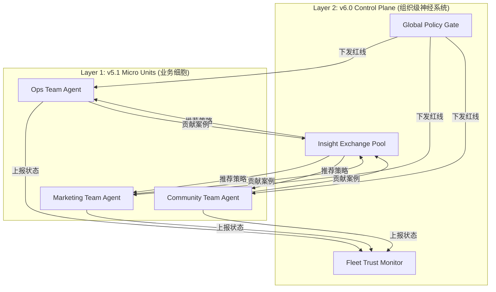

# MAXshot 产品架构设计 v6.0 (Multi-Unit Control Plane)

> **创建日期**：2026-02  
> **维护者**：LEO (Product Manager)  
> **状态**：**North Star (未来北极星)**  
> **版本**：v6.0-Future（基于“细胞-机体”分形战略的终极版）  
> **前置依赖**：v5.1 (Small Team Growth OS)  
> **最后更新**：2026-02（对齐 v5.1 补充修订：三入口、SQL Engine 三级策略、v5.0 保留项）

---

## 🌌 一、战略愿景：从细胞到机体

### 1.1 核心定义
MAXshot v6.0 是 **多单元编排与治理平台 (Multi-Unit Control Plane)**。

它不再是一个单一的 Agent，而是管理 **N 个 v5.1 实例** 的组织级操作系统。

*   **v5.1 (The Cell)**：服务于小微团队的增长操作系统（Ops+Marketing，三入口分工，SQL Engine 三级策略）。
*   **v6.0 (The Organism)**：服务于中大型组织的集群管理中枢。

### 1.2 为什么需要 v6.0？
当企业拥有多个业务线（或 MAXshot 拥有多个租户）时，单体 v5.1 无法解决以下问题：
1.  **孤岛效应**：Team A 的成功策略，Team B 无法自动复用。
2.  **治理失控**：无法对 50 个 Agent 统一通过“品牌红线”。
3.  **全局盲区**：缺乏上帝视角来监控整体 AI 的健康度。

**核心价值主张**：
> **连接孤岛，统一治理，涌现群体智慧。**

---

## 🏗️ 二、分形架构设计 (The Fractal Architecture)

### 2.1 逻辑拓扑

### 2.2 层级职责划分

| 层级 | 实体 | 职责 | 关键词 |
|------|------|------|--------|
| **L2 (v6.0)** | **Control Plane** | 跨单元协作、统一审计、策略分发、全局风控 | **Governance (治理)** |
| **L1 (v5.1)** | **Micro Unit** | 任务执行、单点闭环、本地记忆、三入口分工、SQL Engine 三级策略 | **Execution (执行)** |
| **L0** | **Capability** | 原子能力（SQL、生成、发布） | **Utility (工具)** |

---

## 🧠 三、v6.0 核心引擎

### 3.1 Insight Exchange (跨团队学习引擎)
**价值**：打破数据孤岛，实现“一方验证，八方受益”。

*   **机制**：
    1.  **Harvest (采集)**：从各 v5.1 单元的 `Strategy Artifacts` 中提取高置信度策略（如“周五发 Meme 效果好”）。
    2.  **Anonymize (脱敏)**：移除具体业务数据，仅保留策略模式（Pattern）。
    3.  **Distribute (分发)**：将通用策略推送到其他单元的 `Recommendation Queue`。
*   **效应**：新加入的团队（冷启动）能直接继承老团队的智慧。

**v5.1 → v6.0 扩展：SQL 模板跨 Unit 共享**

v5.1 的 SQL Engine 三级策略中，**Tier 3（沉淀）** 将验证通过的 LLM 生成 SQL 固化为模板。这是 Insight Exchange 最具体、最可验证的跨团队学习形态：

| 阶段 | 范围 | 机制 |
|------|------|------|
| **v5.1（单 Unit）** | Tier 2 → Tier 3 沉淀 | 本地 Unit 内经验固化 |
| **v6.0（跨 Unit）** | Tier 3 模板 → Insight Exchange | 已毕业模板脱敏后跨 Unit 推荐；接收方可选择采纳或忽略 |

**约束**：跨 Unit 推荐的模板仅作为 Recommendation，不强制覆盖本地 Tier 1；采纳与否必须审计留痕。

### 3.2 Global Policy Gate (全局策略门禁)
**价值**：确保组织级合规，一键下发红线。

*   **机制**：
    *   **Inheritance (继承)**：所有 v5.1 单元强制继承 v6.0 的 Global Policy。
    *   **Override (覆盖)**：Global Policy 优先级 > Local Policy。
    *   **Broadcast (广播)**：危机时刻（如监管新规），一键封禁特定关键词/行为。

**v5.1 宪法对齐：Recommendation Only 原则**

v5.1 已确立「Evolution 对 Router 只能通过 Recommendation 影响，Router 采纳或拒绝必须审计留痕」。v6.0 的 Global → Unit 通信**必须遵循同一原则**：

| 层级 | 机制 | 约束 |
|------|------|------|
| **Global Policy（红线）** | Override = 强制执行 | 仅限合规/安全红线；Unit 无权拒绝，但必须审计留痕 |
| **Global Recommendation（策略建议）** | Recommendation = 可采纳/可拒绝 | Unit 的 Router 有最终裁决权；采纳或拒绝必须写入 Audit Log |

**禁止**：v6.0 不得通过 Global Recommendation 直接覆盖 Unit 的本地 Router 逻辑。全局策略建议 ≠ 直接执行。

### 3.3 Fleet Trust Monitor (集群信任监控)
**价值**：上帝视角，管理 AI 员工团队。

*   **指标**：
    *   **Fleet Health**：集群整体健康度。
    *   **Risk Heatmap**：哪个单元正在频繁触发风控？
    *   **ROI Dashboard**：哪个单元产出最高？

### 3.4 Fleet Dashboard（三入口的 v6.0 扩展）

v5.1 定义了三入口分工（TG Bot / Admin OS / Notion）。v6.0 在此基础上增加**第四入口**——组织级管理面板：

| 入口 | 层级 | 定位 |
|------|------|------|
| **TG Bot** | L1（Unit 级） | 各 Unit 独立，对话交互 |
| **Admin OS** | L1（Unit 级） | 各 Unit 独立，配置/调试/审计 |
| **Notion** | L1（可共享） | 跨 Unit 内容 pipeline 可共享，也可独立 |
| **Fleet Dashboard** | **L2（v6.0 级）** | 跨 Unit 审计总览、策略下发、Insight Exchange 管理、Risk Heatmap |

**Fleet Dashboard ≠ Unit Admin OS 的聚合**。Fleet Dashboard 聚焦治理与协调，不干预单 Unit 的日常操作。

---

## 🔌 四、接入协议 (The Protocol)

为了让 v5.1 能在未来无缝接入 v6.0，v5.1 必须遵守以下 **"v6.0 Ready" 协议**：

1.  **Identity Protocol**：每个 v5.1 实例必须有唯一的 `instance_id` 和 `tenant_id`。
    *   **v5.1 已预留**：`instance_id` 字段（v5.1 §6.2）。
2.  **Telemetry Protocol**：必须按标准格式上报 `Execution Log` 和 `Trust Score`。
    *   **v5.1 已预留**：`telemetry` 接口（v5.1 §6.2）；`Audit Log` 贯穿所有执行（v5.1 §6.1）。
3.  **Policy Protocol**：必须支持远程加载和热更新 `Policy Rules`。
    *   **v5.1 基础**：Soul 变更版本化留痕、新 Request 生效（FSD 00.5 §6.2）。
4.  **Isolation Protocol**：必须保证本地 `Memory` 的数据主权，仅上报脱敏后的 Pattern。
    *   **v5.1 基础**：Experience 权重仅用于 Sandbox/离线分析（v5.1 §2.5），天然隔离。

---

## 📅 五、演进路线图 (The Master Plan)

### Phase 1: Cell Viability (当前阶段)
*   **目标**：打造完美的 v5.1 单体。
*   **动作**：验证 Ops 数据可信化（SQL Engine 三级策略）、Marketing 策略闭环、三入口分工。
*   **v6.0 工作**：**无**（仅保留架构文档作为北极星；v5.1 已预留 instance_id / telemetry）。

### Phase 2: Cell Replication (6-12 个月)
*   **目标**：复制 v5.1 到 10-50 个小微团队。
*   **动作**：积累多租户运营经验，收集跨团队共性需求。
*   **v6.0 工作**：定义 Telemetry 接口，开始手动收集跨团队 Insight。

### Phase 3: Organism Emergence (12-18 个月)
*   **目标**：正式构建 v6.0 Control Plane。
*   **动作**：
    *   开发 Fleet Dashboard。
    *   实现 Insight Exchange 自动化。
    *   推出 "Enterprise Edition"（企业版）。

---

## 🔒 六、终极护城河

如果说 v5.1 的护城河是 **"垂直场景的深度"**。
那么 v6.0 的护城河就是 **"生态网络的密度"**。

当 MAXshot 连接了 100 个 Crypto 团队的 Ops/Marketing 单元时，我们拥有的不仅仅是软件收入，而是 **整个行业的最佳实践图谱**。

**MAXshot v6.0**
*The Operating System for AI Organizations.*
*Connected. Governed. Evolving Together.*
