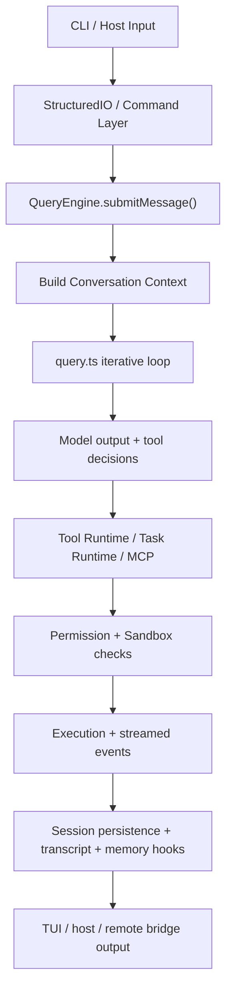

# Claude Code Architecture Analysis

- Analysis date: 2026-04-01
- Source analyzed: `https://github.com/shortknife/claude-code-source`
- Local inspection snapshot: `/tmp/claude-code-source`
- Package identity from source: `@anthropic-ai/claude-code` `v2.1.88`

## 1. Executive Summary

Claude Code is architected as a full terminal agent runtime, not a thin CLI wrapper around a model API.

Its architecture centers on a single conversation/runtime kernel:

- `src/QueryEngine.ts`

Around that kernel, the system layers in:

- CLI command entry and mode switching
- a first-class tool runtime
- a background task / teammate / workflow model
- structured host I/O and remote bridge transports
- permission and sandbox enforcement
- session persistence and memory extraction
- a large TUI rendering layer
- MCP, plugin, and skill extension mechanisms

The important architectural point is this:

**Claude Code is built as an agent operating environment.**

It is designed to support:

- local terminal interaction
- host/SDK embedding
- remote/bridge session execution
- tool-heavy agent loops
- background task management
- persistent session and memory state

That is materially different from a conventional “chat + tools” CLI.

## 2. Repo Shape

The repo exposes a CLI binary:

- `package.json`
- `cli.js`

But the usable architectural source is in `src/`.

Key top-level files and directories:

- `src/QueryEngine.ts`
- `src/Task.ts`
- `src/Tool.ts`
- `src/query.ts`
- `src/commands.ts`
- `src/cli/structuredIO.ts`
- `src/cli/transports/HybridTransport.ts`
- `src/bridge/*`
- `src/tools/*`
- `src/tasks/*`
- `src/services/*`
- `src/utils/*`
- `src/components/*`
- `src/skills/*`
- `src/plugins/*`
- `src/services/mcp/*`

This structure already reveals the design intent:

- one core runtime
- many execution surfaces
- many extension systems
- high productization around terminal UX and remote session transport

## 3. Primary Architectural Layers

I would model the system as 8 major layers.

### 3.1 Entry / CLI Layer

Main files:

- `/tmp/claude-code-source/cli.js`
- `/tmp/claude-code-source/src/commands.ts`
- `/tmp/claude-code-source/src/cli/*`

Responsibilities:

- process startup
- CLI argument handling
- slash command registry
- mode selection
- interactive vs non-interactive execution
- host integration entrypoints

`src/commands.ts` is especially important. It centralizes the command surface and conditionally enables features through `feature('...')` gates.

Representative commands loaded there include:

- auth/login/logout
- memory
- permissions
- hooks
- plan
- review
- tasks
- agents
- mcp
- plugin
- bridge
- desktop/mobile
- chrome
- skills

Architecturally, this means Claude Code is not a single fixed command loop. It is a shell with a large product command surface.

### 3.2 Core Runtime Layer

Main file:

- `/tmp/claude-code-source/src/QueryEngine.ts`

This is the center of the system.

`QueryEngineConfig` shows the runtime dependencies it expects:

- `cwd`
- `tools`
- `commands`
- `mcpClients`
- `agents`
- `canUseTool`
- app state getters/setters
- initial messages
- file cache
- custom system prompts
- model selection / fallback model
- thinking config
- max turns
- budget controls
- JSON schema output constraints
- elicitation handler
- SDK status callback
- snip/compaction hooks

`QueryEngine` owns conversation-scoped mutable state:

- message history
- abort controller
- permission denials
- aggregate usage
- file state cache
- turn-scoped skill discovery
- loaded nested memory paths

The class comment states the design explicitly:

- one `QueryEngine` per conversation
- each `submitMessage()` is one new turn in the same conversation
- session state persists across turns

That makes `QueryEngine` the runtime kernel for:

- turn lifecycle
- prompt assembly
- tool interaction
- state continuity
- persistence hooks
- model execution wiring

### 3.3 Query Loop Layer

Main file:

- `/tmp/claude-code-source/src/query.ts`

This is the lower-level iterative agent loop used by the engine.

Responsibilities visible in imports and state:

- normalize messages for API
- build query config
- manage auto-compact/reactive compact/context collapse
- run tools via `StreamingToolExecutor` and `runTools`
- manage stop hooks
- maintain token budgets and continuation state
- handle tool result summaries
- handle API fallback/recovery behavior

This layer is important because `QueryEngine` is not directly “the model loop.”

A cleaner split exists:

- `QueryEngine`: conversation runtime owner
- `query.ts`: iterative reasoning/tool-execution loop

That separation is one of the stronger design decisions in the codebase.

### 3.4 Tool Runtime Layer

Main files:

- `/tmp/claude-code-source/src/Tool.ts`
- `/tmp/claude-code-source/src/tools/*`

`Tool.ts` defines the actual contract for tools.

The `ToolUseContext` is not minimal. It contains:

- command registry
- full tool registry
- MCP clients/resources
- agent definitions
- thinking config
- current model/debug/query source metadata
- app state getters/setters
- elicitation hooks
- UI rendering hooks
- OS notifications
- memory attachment triggers
- permission context
- file reading/glob limits
- message history
- attribution/file history update hooks

That tells us three things:

1. Tools are first-class runtime participants, not utility helpers.
2. Tools are allowed to interact with UI, app state, permissions, and memory.
3. The tool system is designed to support complex agent execution, not just file reads and shell calls.

Representative tools under `src/tools/*` include:

- file read/write/edit tools
- bash and PowerShell tools
- grep/glob tools
- MCP tools and MCP auth
- agent tools
- task create/list/output tools
- schedule/cron tools
- web search / web fetch
- notebook editing
- synthetic output / ask-user / plan mode tools

This is a runtime tool platform, not a handful of hardcoded functions.

### 3.5 Task / Teammate / Workflow Layer

Main files:

- `/tmp/claude-code-source/src/Task.ts`
- `/tmp/claude-code-source/src/tasks/*`

`Task.ts` defines a real task abstraction with explicit task types:

- `local_bash`
- `local_agent`
- `remote_agent`
- `in_process_teammate`
- `local_workflow`
- `monitor_mcp`
- `dream`

It also defines:

- task statuses
- task IDs
- task output files
- task state base fields
- task handles and kill contracts

This is an architectural signal that Claude Code distinguishes between:

- the foreground conversational agent loop
- background shell execution
- subagents/teammates
- workflow-like long-lived tasks
- monitoring/background infrastructure

That is a meaningful step beyond standard assistant tooling.

It turns the runtime into a multi-execution environment.

### 3.6 Transport / Host Integration Layer

Main files:

- `/tmp/claude-code-source/src/cli/structuredIO.ts`
- `/tmp/claude-code-source/src/cli/transports/HybridTransport.ts`
- `/tmp/claude-code-source/src/bridge/*`

This is one of the most product-defining parts of the architecture.

#### StructuredIO

`StructuredIO` implements a structured stdio protocol with:

- pending request tracking
- control request / response handling
- replayed user message support
- permission prompt mediation
- outbound event queueing
- duplicate response protection

This means the runtime is intentionally embeddable.

It is designed to speak a protocol, not only to print text to a terminal.

#### HybridTransport

`HybridTransport` uses:

- WebSocket for reads
- HTTP POST for writes

It adds:

- event batching
- serialized uploads
- retry/backoff
- queueing/backpressure
- close/drain semantics

This is operational transport engineering, not a toy stream bridge.

The comments make the goal explicit: preserve event order, avoid write collisions, and survive degraded network conditions.

#### Bridge subsystem

The `src/bridge/*` tree is large and includes:

- bridge session startup
- REPL bridge transport adapters
- bridge UI paths
- trusted device / token flow
- session runner logic
- bridge-mode enablement helpers

This shows that remote/bridge execution is not an afterthought. It is a primary deployment mode.

### 3.7 Permissions / Sandbox / Policy Layer

Main directories/files:

- `/tmp/claude-code-source/src/tools/BashTool/*`
- `/tmp/claude-code-source/src/utils/permissions/*`
- `/tmp/claude-code-source/src/components/permissions/*`
- `/tmp/claude-code-source/src/components/sandbox/*`

This layer is deeply integrated.

It is not only a UI confirmation step.

The architecture includes:

- permission modes
- allow/deny/ask rules
- working directory controls
- sandbox network permission flow
- path validation
- shell validation
- tool permission hooks
- host-mediated permission requests through control protocol

This reveals an important design principle:

**the agent is not assumed to be safe by default.**

Execution is filtered through a policy layer that is embedded directly in tool execution and host communication.

### 3.8 Session / Memory / Persistence Layer

Main areas:

- `/tmp/claude-code-source/src/memdir/*`
- `/tmp/claude-code-source/src/services/SessionMemory/*`
- `/tmp/claude-code-source/src/utils/sessionStorage*`
- `/tmp/claude-code-source/src/utils/sessionState*`
- `/tmp/claude-code-source/src/services/extractMemories/*`

This subsystem is larger than a simple chat history store.

The codebase includes:

- transcript recording
- content replacement persistence
- session state change notifications
- memory prompt loading
- session memory extraction hooks
- extract-memories post-processing
- project/team memory files
- session memory file initialization and updates

This means memory is treated as an operational runtime concern.

However, it is still better described as:

- session memory
- extracted memory artifacts
- memory injection/prompt augmentation

rather than a fully separate semantic knowledge graph or long-term personal memory platform.

### 3.9 UI / TUI Layer

Main area:

- `/tmp/claude-code-source/src/components/*`
- `/tmp/claude-code-source/src/ink/*`

The terminal UI is substantial. It includes:

- prompt input
- message rendering
- diff viewers
- task panels
- memory views
- settings and onboarding
- trust/sandbox dialogs
- MCP views
- shell and agent UI surfaces

This means the product should be understood as a stateful terminal application, not just stdout streaming.

## 4. Execution Model

The high-level execution flow looks like this:

This decomposition matters.

There are at least four distinct execution concerns here:

1. turn/session runtime ownership
2. model loop orchestration
3. tool/task execution
4. transport/render/persistence delivery

Claude Code keeps those concerns connected, but not fully collapsed into one file.

## 5. Command System Architecture

The command system is centralized but modular.

`src/commands.ts` imports a very broad set of command modules and assembles them through a memoized registry.

Two things are notable here.

### 5.1 Command surface is a product switchboard

Feature flags gate entire command classes:

- bridge mode
- voice mode
- assistant mode
- proactive mode
- workflows
- peers/buddy
- fork/subagent flows
- remote setup
- ultraplan

That implies the command registry doubles as a product-line configuration surface.

### 5.2 Commands are not the same as tools

The codebase keeps a real distinction between:

- slash/CLI commands
- tools used inside agent execution
- tasks/workflows/agents

This is a good architectural separation.

Commands are user control surfaces.
Tools are agent-execution surfaces.
Tasks are long-lived execution objects.

## 6. Tool and Agent Model

The architecture is built to let the model operate in an execution-rich environment.

A few things stand out.

### 6.1 Tools are stateful runtime actors

Because tools receive `ToolUseContext`, they can:

- observe state
- mutate state
- render UI
- trigger notifications
- participate in permission flows
- coordinate with tasks/agents

This is much broader than simple RPC-style tool calling.

### 6.2 Agent and teammate support is native

The source includes:

- `src/tools/AgentTool/*`
- `src/tasks/LocalAgentTask/*`
- `src/tasks/RemoteAgentTask/*`
- `src/tasks/InProcessTeammateTask/*`
- `src/utils/swarm/*`

This strongly suggests that subagents are designed as runtime citizens, not custom hacks added on top of the main loop.

### 6.3 Workflows are present but runtime-bound

The existence of:

- `local_workflow`
- workflow command gates
- task abstractions

indicates a workflow layer exists, but within the runtime model rather than as a separate orchestration system.

## 7. Transport and Bridge Architecture

This is one of the strongest parts of the system.

Most agent products stop at:

- local terminal
- maybe an HTTP endpoint

Claude Code goes further by implementing an explicit transport architecture.

### 7.1 Structured protocol boundary

`StructuredIO` establishes a protocol boundary that makes it possible to:

- embed Claude Code in other hosts
- route permission prompts externally
- replay user messages
- send/receive control messages rather than raw text only

### 7.2 Remote bridge as first-class mode

The bridge subsystem is large enough to indicate a formal remote execution mode.

This matters because it means the architecture already assumes:

- non-local execution surfaces
- remote session control
- transport reliability problems
- state resumption
- host/device trust boundaries

### 7.3 Event streaming is treated as infrastructure

`HybridTransport` and adjacent transport code show care around:

- batching
- retries
- queue pressure
- event ordering
- draining on close

That is operational runtime engineering, not just protocol glue.

## 8. Memory and Persistence Model

Claude Code uses more than one memory-like subsystem.

At minimum, the code reveals three distinct categories.

### 8.1 Transcript/session persistence

The runtime records session artifacts and transcript data.

This is the lowest persistence layer.

### 8.2 Prompt-injected memory

`memdir` and `loadMemoryPrompt()` indicate memory content can be loaded into query context.

This is a recall/injection mechanism.

### 8.3 Extracted session memory

`services/SessionMemory/*` and `services/extractMemories/*` show post-sampling or background extraction that updates persistent memory artifacts.

This is not just “save chat history.”
It is closer to a summarizing/structuring memory pipeline.

Still, architecturally, the memory system appears to be centered on:

- session-level memory maintenance
- file-backed/project-backed memory artifacts
- prompt augmentation

rather than a universal long-term user memory graph.

## 9. Extension Architecture

Claude Code is highly extensible, but not through a single plugin API only.

There are at least four extension channels.

### 9.1 Commands

New command modules can extend the user control surface.

### 9.2 Tools

The tool registry extends the model’s action space.

### 9.3 MCP

The runtime supports MCP clients/resources as part of the tool execution context.

### 9.4 Skills and plugins

Relevant areas:

- `/tmp/claude-code-source/src/skills/*`
- `/tmp/claude-code-source/src/plugins/*`
- `/tmp/claude-code-source/src/utils/plugins/*`

The skills subsystem is not superficial.

Observed capabilities include:

- loading from user/project/managed directories
- deduplication
- dynamic discovery
- conditional activation by matching file paths
- bundled skill extraction to disk for model consumption
- plugin-provided skills and commands

This is a fairly advanced extension model.

It mixes:

- static bundled capabilities
- file-based local capabilities
- dynamically activated contextual capabilities
- plugin-managed capability packaging

## 10. Architectural Strengths

### 10.1 Clear runtime kernel

`QueryEngine` provides a recognizable center of gravity.

That is valuable in a large codebase.

### 10.2 Strong decomposition between runtime, query loop, tools, tasks, and transport

The system is not perfectly decoupled, but the major runtime concerns are identifiable and reasonably separated.

### 10.3 Serious transport and permission engineering

Many agent systems are weak exactly where Claude Code is strong:

- permission mediation
- remote/host embedding
- structured control protocol
- event streaming reliability

### 10.4 Extension model is broad

The architecture supports product evolution through:

- commands
- tools
- MCP
- skills
- plugins
- feature flags

### 10.5 The system is clearly product-grade, not prototype-grade

The repo contains substantial work around:

- diagnostics
- analytics
- session recovery
- compaction
- UI states
- remote integration
- memory management
- background tasks

That is the profile of a production runtime.

## 11. Architectural Costs and Risks

### 11.1 High central complexity

`QueryEngine` is powerful, but it also concentrates a lot of runtime coordination.

That usually increases:

- onboarding cost
- regression risk
- difficulty of proving invariants

### 11.2 Feature-flag density is very high

The codebase uses many `feature('...')` gates.

That gives product flexibility, but it also creates:

- multiple runtime personalities
- conditional code paths that are harder to reason about
- more difficult static understanding
- more difficult testing completeness

### 11.3 Product and runtime concerns are tightly coupled

Because the same codebase handles:

- UI
- transport
- memory
- tasks
- permissions
- agent loop
- command system

maintenance discipline has to stay very high.

Otherwise, the architecture can become difficult to evolve cleanly.

### 11.4 The system is large enough that “understanding Claude Code” requires subsystem-level reading

This is not a small-core/small-plugin architecture.

It is a large integrated runtime platform.

## 12. Most Important Files to Read Next

If the goal is to understand the architecture efficiently, the best reading order is:

1. `/tmp/claude-code-source/src/QueryEngine.ts`
2. `/tmp/claude-code-source/src/query.ts`
3. `/tmp/claude-code-source/src/Tool.ts`
4. `/tmp/claude-code-source/src/Task.ts`
5. `/tmp/claude-code-source/src/cli/structuredIO.ts`
6. `/tmp/claude-code-source/src/cli/transports/HybridTransport.ts`
7. `/tmp/claude-code-source/src/commands.ts`
8. `/tmp/claude-code-source/src/services/SessionMemory/sessionMemory.ts`
9. `/tmp/claude-code-source/src/skills/loadSkillsDir.ts`
10. `/tmp/claude-code-source/src/bridge/*`

That order maps closely to the actual architecture:

- runtime kernel
- reasoning loop
- execution contract
- async task model
- host/remote transport
- product command surface
- persistence/memory
- extension system

## 13. Final Assessment

Claude Code should be understood as:

**a terminal-first agent runtime platform with a central conversation kernel, a rich tool/task execution substrate, a structured transport boundary, and product-grade session/permission/memory systems.**

It is not best described as:

- just a coding CLI
- just a chat interface with tools
- just a terminal wrapper over a model API

Its real architectural identity is:

- runtime-centric
- tool-native
- task-aware
- transport-aware
- policy-aware
- session-persistent
- productized for both local and bridged execution

## 14. Appendix: Key Source Evidence

### Core runtime

- `/tmp/claude-code-source/src/QueryEngine.ts`
- `/tmp/claude-code-source/src/query.ts`

### Tool and task contracts

- `/tmp/claude-code-source/src/Tool.ts`
- `/tmp/claude-code-source/src/Task.ts`
- `/tmp/claude-code-source/src/tools/*`
- `/tmp/claude-code-source/src/tasks/*`

### CLI and command surface

- `/tmp/claude-code-source/cli.js`
- `/tmp/claude-code-source/src/commands.ts`
- `/tmp/claude-code-source/src/cli/*`

### Transport and bridge

- `/tmp/claude-code-source/src/cli/structuredIO.ts`
- `/tmp/claude-code-source/src/cli/transports/HybridTransport.ts`
- `/tmp/claude-code-source/src/bridge/*`

### Persistence and memory

- `/tmp/claude-code-source/src/utils/sessionStorage*`
- `/tmp/claude-code-source/src/utils/sessionState*`
- `/tmp/claude-code-source/src/memdir/*`
- `/tmp/claude-code-source/src/services/SessionMemory/*`
- `/tmp/claude-code-source/src/services/extractMemories/*`

### Extensions

- `/tmp/claude-code-source/src/skills/*`
- `/tmp/claude-code-source/src/plugins/*`
- `/tmp/claude-code-source/src/services/mcp/*`
