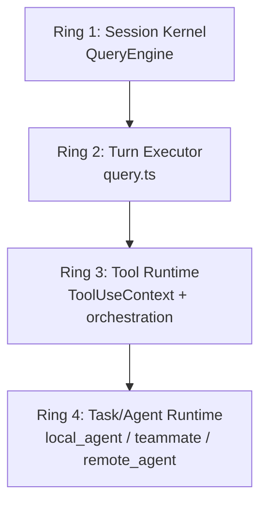

# Claude Code Harness / Runtime Deep Dive

- Analysis date: 2026-04-01
- Source analyzed: `https://github.com/shortknife/claude-code-source`
- Local inspection snapshot: `/tmp/claude-code-source`
- Scope: runtime kernel, query loop, tool execution, task model, transport boundary

## 1. Purpose of This Document

This document is narrower than the full architecture analysis.

It focuses only on the runtime core that makes Claude Code behave like an agent execution environment:

- `src/QueryEngine.ts`
- `src/query.ts`
- `src/Tool.ts`
- `src/Task.ts`
- `src/services/tools/toolOrchestration.ts`
- `src/services/tools/StreamingToolExecutor.ts`
- `src/cli/structuredIO.ts`
- `src/cli/transports/HybridTransport.ts`
- selected task/teammate runtime files

The question this document answers is:

**how does Claude Code actually run a turn, preserve state, execute tools, and manage long-lived agent activity?**

## 2. Top-Level Runtime Thesis

Claude Code’s runtime is organized around four nested control loops:

1. **session loop** — one `QueryEngine` per conversation
2. **turn loop** — one `submitMessage()` call per user turn
3. **reasoning/execution loop** — `query.ts` iterates until the turn reaches a terminal state
4. **tool/task loop** — tools, agents, teammates, and remote tasks continue running inside the turn or beyond it

That hierarchy is the key to understanding the product.

It is not just “prompt in, tool call out.”

It is:

- a persistent session owner
- calling into a repeatable reasoning loop
- which can spawn and coordinate execution units
- while speaking through a structured transport boundary

## 3. Runtime Kernel: `QueryEngine`

Primary file:

- `/tmp/claude-code-source/src/QueryEngine.ts`

### 3.1 What `QueryEngine` owns

`QueryEngine` is the conversation-scoped runtime owner.

It owns mutable state across turns:

- `mutableMessages`
- `abortController`
- `permissionDenials`
- `totalUsage`
- `readFileState`
- `discoveredSkillNames`
- `loadedNestedMemoryPaths`

This is an important design choice.

The runtime does **not** rebuild conversation state from scratch every turn. Instead, the engine instance is the in-memory owner of:

- conversation history
- runtime caches
- session-level side data
- per-session coordination state

### 3.2 What `submitMessage()` actually does

`submitMessage()` is not just “send prompt to model.”

It performs a full turn bootstrap:

1. reads config and app state
2. derives model and thinking config
3. fetches system prompt parts
4. injects memory mechanics when needed
5. builds initial `ToolUseContext`
6. handles orphaned permissions
7. runs `processUserInput()`
8. appends user/attachment/command-generated messages to conversation state
9. persists transcript early so resume is possible even before the API answers
10. refreshes context after slash-command processing
11. loads skills/plugins
12. emits a system-init message
13. either returns early for local-only commands or enters `query()`
14. normalizes query output into SDK/result messages
15. persists transcript and flushes on turn completion

So `submitMessage()` is a **turn bootstrapper + runtime bridge**, not only a model caller.

### 3.3 Why `QueryEngine` matters architecturally

It centralizes several concerns that many agent systems leave scattered:

- transcript safety before model call
- replay/ack behavior for user messages
- system init surface for SDK/host
- structured output retry tracking
- budget termination
- final result normalization
- session-level mutable state continuity

This means `QueryEngine` is best understood as a **conversation runtime kernel** rather than a helper around API calls.

## 4. Input Processing Pipeline Before Model Execution

Relevant source:

- `/tmp/claude-code-source/src/utils/processUserInput/processUserInput.ts`

Before the reasoning loop starts, Claude Code preprocesses user input into message objects.

This stage can:

- show the in-progress user input immediately
- interpret slash commands
- attach additional context/messages
- run prompt submit hooks
- block continuation
- inject extra system/attachment messages
- decide whether the turn should query the model at all

This creates a clean split:

- **input normalization and command handling** happen before `query.ts`
- **model/tool reasoning** only starts after that decision

Architecturally, that is important because it keeps non-model control surfaces out of the main reasoning loop.

## 5. The Real Agent Loop: `query.ts`

Primary file:

- `/tmp/claude-code-source/src/query.ts`

### 5.1 What `query.ts` is

`query.ts` is the iterative execution engine for a single turn.

It is not a thin wrapper. It manages:

- message projection after compaction
- memory prefetch
- skill discovery prefetch
- context collapse / snip / microcompact / autocompact
- token budget state
- model invocation and fallback
- streamed tool detection
- tool execution
- stop hooks
- retry transitions
- terminal turn classification

This file is the closest thing to Claude Code’s **agent loop state machine**.

### 5.2 The loop state

`query.ts` maintains explicit mutable state across iterations:

- `messages`
- `toolUseContext`
- `autoCompactTracking`
- `maxOutputTokensRecoveryCount`
- `hasAttemptedReactiveCompact`
- `maxOutputTokensOverride`
- `pendingToolUseSummary`
- `stopHookActive`
- `turnCount`
- `transition`

That is significant because the system treats a single “turn” as potentially involving multiple internal retries/continuations.

The model loop is not assumed to succeed in one pass.

### 5.3 What happens in each query iteration

A single iteration of `queryLoop()` does roughly this:

1. restore current state
2. prefetch relevant memory and skill-discovery work
3. build query-chain tracking metadata
4. derive `messagesForQuery` after compact-boundary projection
5. apply tool-result budget enforcement
6. apply snip compact
7. apply microcompact
8. apply context-collapse projection
9. build the final system prompt
10. run autocompact if needed
11. create/update `toolUseContext`
12. initialize tool execution helpers
13. determine active model and runtime options
14. invoke the model stream
15. collect assistant messages and tool uses
16. execute tools live or after streaming
17. run stop/recovery logic
18. either continue with updated state or return terminally

This makes `query.ts` a **resilient turn executor**, not a single-pass stream consumer.

## 6. Recovery Paths Are First-Class

One of the most important runtime properties is that failure/recovery is built into the main loop rather than bolted on after the fact.

### 6.1 Prompt-too-long recovery

The loop can withhold prompt-too-long errors and try recovery paths first:

- collapse drain retry
- reactive compact retry

### 6.2 Max-output-tokens recovery

It can escalate output-token limits and then fall back to continuation prompts.

### 6.3 Fallback-model retry

When a fallback trigger fires, the loop:

- clears tool execution state for the failed attempt
- may strip model-bound thinking signatures
- switches models
- retries the request

### 6.4 Abort handling

Abort is also treated explicitly.

If the turn aborts while tools are executing, the loop can:

- synthesize missing tool results
- cancel sibling work
- emit interruption messages
- stop before invalid API state accumulates

This is not accidental robustness. It is part of the runtime design.

## 7. Tool Execution Model

Primary files:

- `/tmp/claude-code-source/src/Tool.ts`
- `/tmp/claude-code-source/src/services/tools/toolOrchestration.ts`
- `/tmp/claude-code-source/src/services/tools/StreamingToolExecutor.ts`

### 7.1 Tool execution has two modes

Claude Code supports two execution strategies:

1. **post-stream orchestration** via `runTools()`
2. **streaming execution** via `StreamingToolExecutor`

That distinction matters.

It means the runtime can begin executing tools while assistant output is still streaming, rather than waiting for a fully completed assistant message every time.

### 7.2 `runTools()` orchestration model

`runTools()` partitions tool uses into batches based on concurrency safety.

The rule is:

- concurrency-safe tools may run together
- non-concurrency-safe tools run serially

This is a good example of runtime policy embedded in the tool contract.

The model does not arbitrarily control concurrency. The runtime decides it using tool metadata and parsed input.

### 7.3 `StreamingToolExecutor` behavior

`StreamingToolExecutor` tracks tools as they appear in the stream.

It maintains per-tool state:

- queued
- executing
- completed
- yielded

It also manages:

- concurrent-safe vs exclusive tools
- immediate progress delivery
- ordered result emission
- synthetic error results for discarded/aborted tools
- sibling cancellation propagation
- interruptibility detection

This is a sophisticated streaming execution substrate.

The key runtime idea is:

**tool execution is not just a response to the completed assistant message; it is part of the stream-time execution model.**

### 7.4 Tool context mutation is explicit

Some tools produce context modifiers instead of only result messages.

Those modifiers are applied back into `ToolUseContext`, allowing the execution environment to evolve during the turn.

This is a strong design choice because it acknowledges that:

- running tools can change what future tools or messages should see
- the runtime context itself is an evolving object

## 8. Permission Boundary Inside the Runtime

Relevant files:

- `/tmp/claude-code-source/src/Tool.ts`
- `/tmp/claude-code-source/src/cli/structuredIO.ts`
- `/tmp/claude-code-source/src/tools/BashTool/*`
- `/tmp/claude-code-source/src/utils/permissions/*`

The permission boundary is not external to the runtime.

It is threaded through:

- `CanUseToolFn`
- `ToolUseContext`
- `StructuredIO` control requests
- tool-specific validation logic

This gives the runtime a layered permission model:

1. static rules/modes
2. tool-specific validation
3. host-mediated permission prompts
4. cancellation and decision recording

This is important because it prevents the architecture from collapsing into “model suggests tool → tool runs.”

The runtime remains the authority.

## 9. Task Model and Long-Lived Execution

Primary files:

- `/tmp/claude-code-source/src/Task.ts`
- `/tmp/claude-code-source/src/tasks/LocalAgentTask/LocalAgentTask.tsx`
- `/tmp/claude-code-source/src/tasks/RemoteAgentTask/RemoteAgentTask.tsx`
- `/tmp/claude-code-source/src/tasks/InProcessTeammateTask/InProcessTeammateTask.tsx`
- `/tmp/claude-code-source/src/utils/swarm/inProcessRunner.ts`
- `/tmp/claude-code-source/src/utils/swarm/spawnInProcess.ts`

### 9.1 Why the task abstraction matters

Tasks are the runtime’s answer to “execution that outlives one immediate tool call.”

A task has:

- ID
- type
- lifecycle status
- start/end times
- output file
- task-specific metadata

This makes tasks durable runtime objects rather than transient events.

### 9.2 `LocalAgentTask`

`LocalAgentTask` handles background local agent execution.

It supports:

- registration into task state
- per-task abort controllers
- cleanup hooks
- progress updates
- summaries
- completion/failure transitions
- evict-after policies

This means background agents are not “just spawned promises.”
They are stateful tracked runtime entities.

### 9.3 In-process teammates

The in-process teammate flow is even more revealing.

`runInProcessTeammate()` shows that a teammate is given:

- its own identity and agent context
- its own system prompt construction path
- its own accumulated message history
- its own compaction path when token thresholds are crossed
- its own work abort controller
- its own task state mirror in AppState

This is effectively a nested runtime loop living inside the parent runtime.

That is why “teammate” in this system is not a mere label. It is a separate execution actor with controlled shared infrastructure.

### 9.4 Remote agents

The remote task layer confirms that not all agents are local subprocesses or in-process loops.

There is also a remote task model with:

- registration
- session polling
- task restoration
- archive/cleanup behavior

So the task model spans:

- local shell work
- local background agents
- in-process teammates
- remote agents

## 10. Harness Structure: The Four Runtime Rings

A useful way to model Claude Code’s harness is as four rings.

### Ring 1: Session kernel

Responsible for:

- conversation state ownership
- message persistence
- system init
- transcript durability
- SDK result shaping

### Ring 2: Turn executor

Responsible for:

- retries
- compaction/collapse
- tool loop decisions
- output recovery
- stop-hook continuation

### Ring 3: Tool runtime

Responsible for:

- tool permissions
- concurrency policy
- live execution
- progress delivery
- context mutation

### Ring 4: Task/agent runtime

Responsible for:

- durable background work
- teammate execution
- remote sessions
- task state tracking
- cross-turn / cross-surface execution

This ring model explains why the product feels more like an operating environment than a shell script.

## 11. Structured I/O and Transport Boundary

Primary files:

- `/tmp/claude-code-source/src/cli/structuredIO.ts`
- `/tmp/claude-code-source/src/cli/transports/HybridTransport.ts`

### 11.1 `StructuredIO` is a protocol adapter

Its role is to translate between the runtime and a structured host protocol.

It provides:

- line parsing
- control request bookkeeping
- permission-result handling
- replayed user message insertion
- outbound event queuing
- duplicate-response safety

This is effectively the runtime’s host adapter.

### 11.2 `HybridTransport` is a remote event transport

It solves a specific infrastructure problem:

- read from a websocket
- write through HTTP POST
- preserve event order
- batch stream events
- retry safely
- bound failure behavior on close

This means the transport layer is designed to preserve runtime semantics, not just connectivity.

That is a major reason Claude Code can support bridge-like deployment modes without rewriting the core engine.

## 12. Memory Inside the Runtime Core

Primary files:

- `/tmp/claude-code-source/src/services/SessionMemory/sessionMemory.ts`
- `/tmp/claude-code-source/src/memdir/*`

### 12.1 Session memory is hook-driven

`initSessionMemory()` registers a post-sampling hook.

That hook:

- runs only on the main thread
- respects a feature gate and config
- checks extraction thresholds
- creates an isolated context
- builds a memory update prompt
- runs a forked agent to update the memory file

This means memory update is not hardcoded into the main loop. It is integrated as a hook-driven background maintenance process.

### 12.2 The architecture uses isolated contexts for maintenance work

The session-memory updater uses a subagent/forked context to avoid polluting the parent runtime state.

That is an important harness pattern:

- maintenance work is done through the same runtime substrate
- but in isolated execution contexts

That is cleaner than ad hoc direct mutation.

## 13. Skill Loading as Runtime Enrichment

Primary file:

- `/tmp/claude-code-source/src/skills/loadSkillsDir.ts`

The skills subsystem is not just startup-time loading.

It supports:

- managed/user/project/additional directory loading
- deduplication by file identity
- conditional skills activated by path patterns
- dynamic discovery of nested `.claude/skills` directories
- precedence by path depth
- listener notification when dynamic skill state changes

This means skills are treated as runtime-enrichable context, not static configuration.

That is a meaningful harness trait because it lets the runtime evolve its available capability set during a session based on file interactions.

## 14. The Most Important Runtime Design Decisions

After reading the source, the most important runtime design decisions are these.

### 14.1 One conversation kernel, not one turn object per request

The engine is session-owned.

### 14.2 One iterative turn executor, not one-shot model invocation

The query loop treats continuation and recovery as normal behavior.

### 14.3 Tool execution is runtime-governed, not model-governed

The model proposes; the runtime decides concurrency, permissions, and execution ordering.

### 14.4 Long-lived tasks are explicit domain objects

Agents, teammates, and remote sessions are represented as tasks, not temporary callbacks.

### 14.5 Transport is abstracted enough to support multiple hosting surfaces

The same runtime can speak to terminal, SDK, or remote bridge contexts.

## 15. Architectural Reading of Claude Code’s Harness

If reduced to one sentence:

**Claude Code’s harness is a persistent conversation kernel that drives a retry-capable turn executor, which in turn governs a stateful tool runtime and a durable task/agent runtime through a structured transport boundary.**

That is the cleanest technical description of the runtime I can defend from the source.

## 16. Practical Reading Order for Deeper Study

If this runtime is being studied specifically for harness design, the next file order should be:

1. `/tmp/claude-code-source/src/QueryEngine.ts`
2. `/tmp/claude-code-source/src/query.ts`
3. `/tmp/claude-code-source/src/services/tools/toolOrchestration.ts`
4. `/tmp/claude-code-source/src/services/tools/StreamingToolExecutor.ts`
5. `/tmp/claude-code-source/src/Tool.ts`
6. `/tmp/claude-code-source/src/Task.ts`
7. `/tmp/claude-code-source/src/tasks/LocalAgentTask/LocalAgentTask.tsx`
8. `/tmp/claude-code-source/src/utils/swarm/inProcessRunner.ts`
9. `/tmp/claude-code-source/src/cli/structuredIO.ts`
10. `/tmp/claude-code-source/src/cli/transports/HybridTransport.ts`

## 17. Final Conclusion

Claude Code’s runtime is strong because it combines these properties in one system:

- persistent session ownership
- iterative and recoverable turn execution
- first-class tool contracts
- explicit task and teammate abstractions
- embedded permission governance
- structured transport integration
- hook-driven memory maintenance
- runtime-enrichable skill discovery

That combination is what makes it a serious agent runtime rather than a conventional tool-calling CLI.
