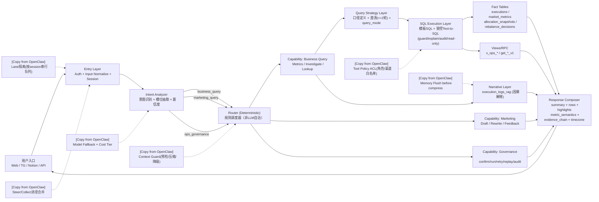

# MAXshot v5.1 Architecture with OpenClaw Borrow Map

> Status: Draft v1  
> Purpose: Visualize MAXshot v5.1 runtime flow and identify high-value OpenClaw patterns to borrow.

## 1) Runtime Flow (v5.1)

## 2) Borrow Priority

1. `Lane隔离`（P0）  
按 session 串行执行，解决并发串话与状态污染。

2. `Steer/Collect`（P0）  
短时间窗口内消息合并/修正，降低错误路由。

3. `Context Guard`（P1）  
上下文预算预检、自动压缩、降级策略。

4. `Tool Policy ACL`（P1）  
执行前做 capability/tool 白名单权限过滤。

5. `Model Fallback + Cost Tier`（P1）  
意图层低成本优先，复杂任务自动升档与降级重试。

6. `Memory Flush before compress`（P2）  
压缩前先写回关键上下文，减少可追溯信息损失。

## 3) Current vs Target Gap

| 模块 | 当前状态 | 目标状态 | 优先级 |
|---|---|---|---|
| Entry 并发控制 | 无显式 Lane 隔离 | session 串行队列 + overflow 策略 | P0 |
| 消息合并 | 单条请求处理 | Steer/Collect 窗口合并 | P0 |
| 查询澄清 | 已有 2 轮澄清基础 | 覆盖更多 query 模式 + UI 推荐问法 | P0 |
| SQL 执行 | 模板/RPC 为主 | 模板 + 受控 Text-to-SQL 生产闭环 | P0 |
| 权限策略 | 基础 gate | Tool/Capability ACL 分层白名单 | P1 |
| 上下文治理 | 基础 session | token 预算 + 自动压缩 + 降级 | P1 |
| 模型策略 | 基础 fallback | 成本分级 + 自动重试链路 | P1 |
| 记忆治理 | 已有 RAG 与事实层 | Flush + 精简写入策略标准化 | P2 |

## 4) Implementation Notes

- Borrow pattern, do not copy architecture wholesale.
- Preserve MAXshot principle: `Router = deterministic scheduler`.
- Business fact answers must remain SQL/fact driven; narrative is explanation only.
